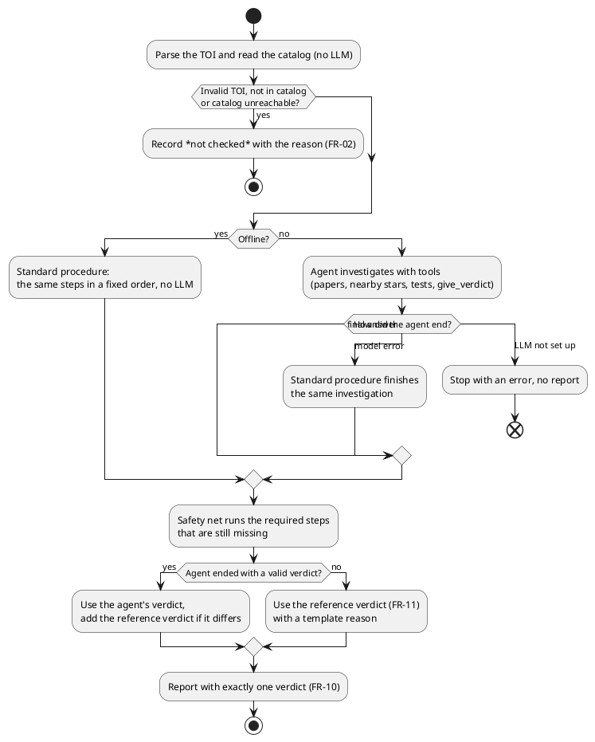

# Activity Diagram - one check

Steps of one check of a candidate, from the TOI number to the report (UC-01).

```plantuml
@startuml
start
:Parse the TOI and read the catalog (no LLM);
if (Invalid TOI, not in catalog\nor catalog unreachable?) then (yes)
  :Record *not checked* with the reason (FR-02);
  stop
endif
if (Offline?) then (yes)
  :Standard procedure:\nthe same steps in a fixed order, no LLM;
else (no)
  :Agent investigates with tools\n(papers, nearby stars, tests, give_verdict);
  switch (How did the agent end?)
  case (final answer)
  case (model error)
    :Standard procedure finishes\nthe same investigation;
  case (LLM not set up)
    :Stop with an error, no report;
    end
  endswitch
endif
:Safety net runs the required steps\nthat are still missing;
if (Agent ended with a valid verdict?) then (yes)
  :Use the agent's verdict,\nadd the reference verdict if it differs;
else (no)
  :Use the reference verdict (FR-11)\nwith a template reason;
endif
:Report with exactly one verdict (FR-10);
stop
@enduml
```
