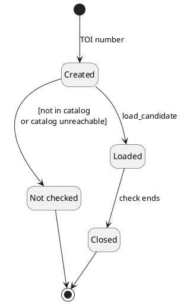

# State Diagram - Investigation

States of one `Investigation`, the object that holds one check of a candidate (UC-01).

```plantuml
@startuml
hide empty description

state "Created" as Created
state "Not checked" as NotChecked
state "Loaded" as Loaded
state "Closed" as Closed

[*] --> Created : TOI number
Created --> NotChecked : [not in catalog\nor catalog unreachable]
Created --> Loaded : load_candidate
Loaded --> Closed : check ends
NotChecked --> [*]
Closed --> [*]
@enduml
```
